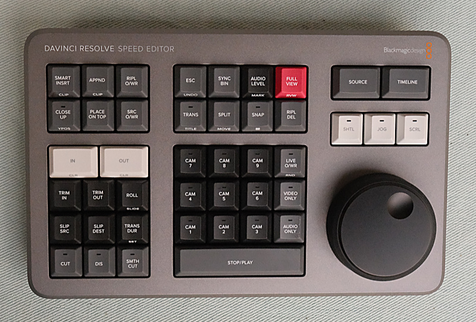
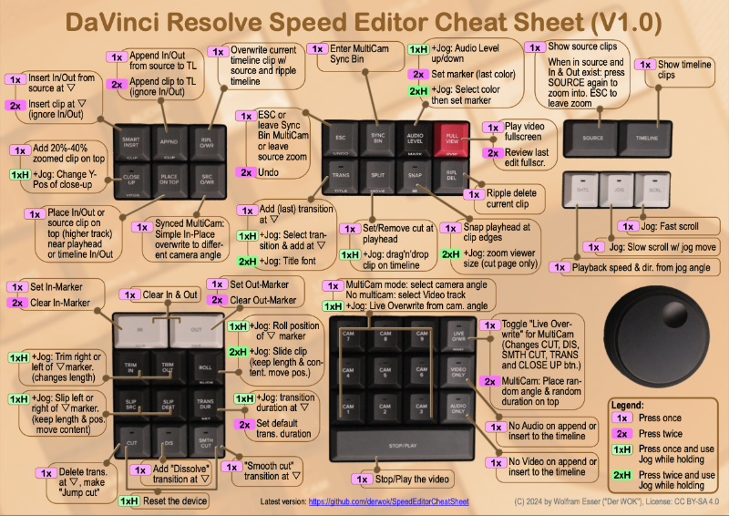

# Speed Editor Cheat Sheet

- Dies ist ein Spickzettel für den 'DaVinci Resolve Speed Editor' von Blackmagic Design.
- Lade einfach das **[DaVinci Resolve Speed Editor Cheat Sheet.pdf](https://raw.githubusercontent.com/derwok/SpeedEditorCheatSheet/master/DaVinci%20Resolve%20Speed%20Editor%20Cheat%20Sheet.pdf)** herunter und drucke es auf eine A4-Seite aus.
- Der DaVinci Resolve Speed Editor ist eine erschwingliche Hardware-Tastatur zur Steuerung des Bearbeitungsprozesses von Video- und Audiomaterial (hauptsächlich auf der sogenannten "Cut Page") innerhalb der DaVinci Resolve Videobearbeitungssoftware.

## Rechtliches
* Dies ist kein offizielles Support-Dokument von Blackmagic Design. Dies ist lediglich die Arbeit eines privaten Nutzers, die für andere möglicherweise hilfreich sein könnte oder auch nicht.
* Es wird keine Garantie für den Inhalt dieses Repos gegeben. Herunterladen und Nutzung auf eigene Gefahr.
* Blackmagic Design, DaVinci Resolve und DaVinci Resolve Speed Editor sind eingetragene Marken von Blackmagic Design Pty Ltd., Australien.

### Lizenz:
Dieses Werk ist lizenziert unter [CC BY-SA 4.0](https://creativecommons.org/licenses/by-sa/4.0).
